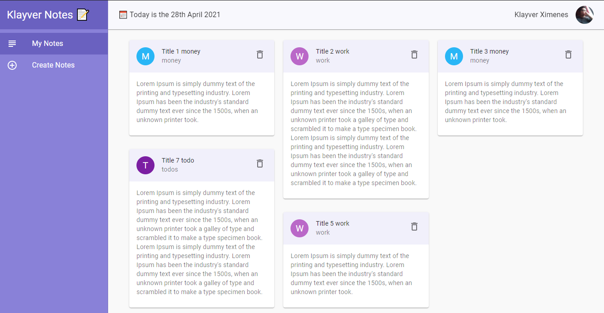

## Notes 📝

[](https://github.com/Klayverx)

<h4 align="center">
  Notes é uma aplicação usada para anotações utilizando notas.
</h4>



## 🧪 Tecnologias

Este projeto foi desenvolvido usando as seguintes tecnologias:

- [React](https://reactjs.org)
- [Material UI](https://material-ui.com/)

## 🚀 Iniciando

### Requisitos

- Você precisa instalar tanto [Node.js](https://nodejs.org/en/download/) e [Yarn](https://yarnpkg.com/) para executar o projeto.

**Clone o repositório e acesse a pasta**

```bash
$ git clone https://github.com/Klayverx/note-taking.git && cd note-taking
```

**Siga os passos abaixo**
```bash
# Instale as dependências
$ yarn
# Execute o backend fake server
$ yarn server
# Execute o web server
$ yarn start
```

A aplicação estará disponível para acesso em seu navegador em `http://localhost:3000`
